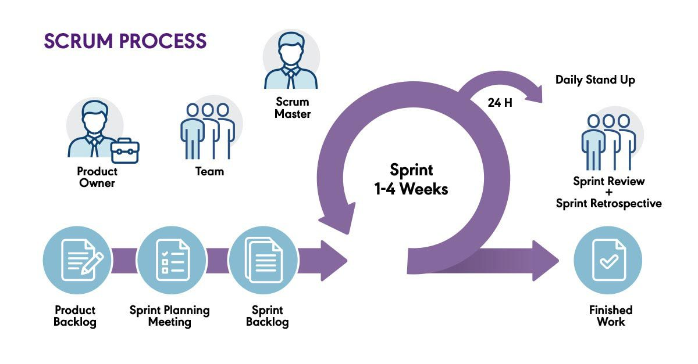
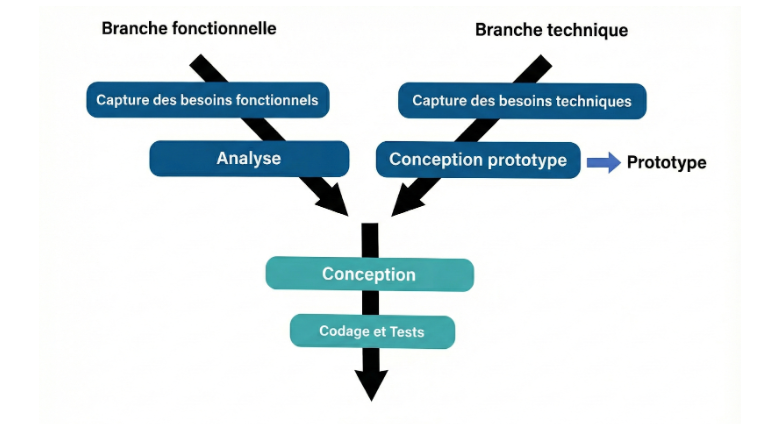
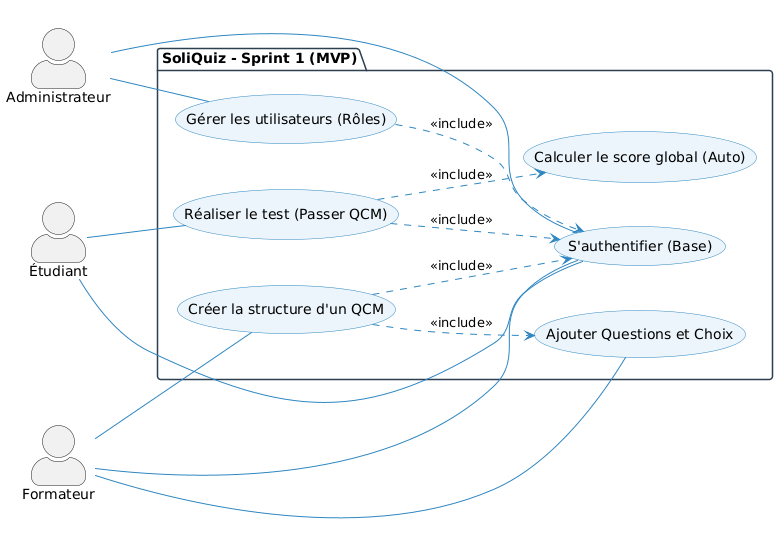
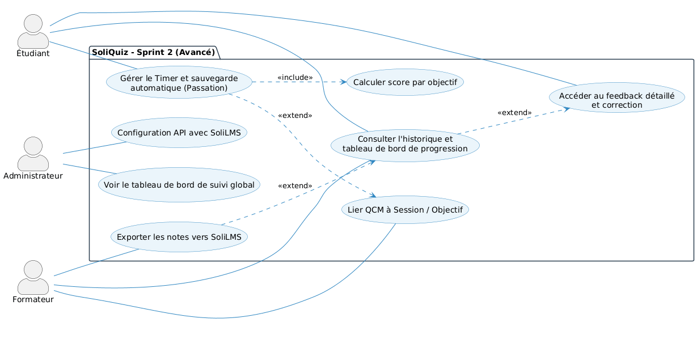

  
  

# **Projet de Fin de Formation**
### Système de QCM Interactif — **SoliQuiz**

**Réalisé par :** BENYEKHLEF Anouar  
**Encadré par :** M. ESSARRAJ Fouad  
**Filière :** Développement Mobile et Web

---

## Sommaire

  

1

Contexte du projet

  

2

Méthodologie de travail

  

3

Branche Fonctionnelle

  

4

Branche Technique

  

5

Conception

  

6

Démonstration

  

7

Conclusion

---

## 1. Contexte du projet

  

    <h4>🎯 Présentation</h4>
    
<strong>SoliQuiz</strong> est un projet de fin de formation, conçu pour répondre aux besoins concrets du centre digital <strong>Solicode</strong>.

    
Il s'agit d'une plateforme centralisée pour la <strong>création, le passage et l'analyse de QCM</strong>.

  

  ---
  

    <h4>⚠️ Problématique</h4>
    <ul>
      <li>**Aveuglement pédagogique** : Manque de visibilité en temps réel sur l'acquisition des compétences (scores déconnectés des objectifs).</li>
      <li>**Invisibilité des lacunes** : Incapacité technique d'associer les questions aux micro-objectifs pédagogiques.</li>
      <li>**Stagnation de l'apprentissage** : Feedback "sec" sans explications, limitant les axes d'amélioration.</li>
      <li>**Rupture administrative** : Report manuel chronophage vers SoliLMS et fragmentation de l'expérience (pas de mobile).</li>
    </ul>
  

  ----
  
  

    <h4>👥 Acteurs</h4>
    <ul>
      <li><strong>Étudiant :</strong> Passer les QCM & suivre sa progression</li>
      <li><strong>Formateur :</strong> Créer les QCM & consulter les résultats</li>
      <li><strong>Administrateur :</strong> Superviser & piloter la plateforme</li>
    </ul>
  

  
  

    <h4>✅ Objectifs</h4>
    <ul>
      <li>Remplacer Google Forms par un outil interne</li>
      <li>Automatiser le flux d'évaluation</li>
      <li>Lier chaque QCM à un objectif précis</li>
      <li>Synchroniser les notes avec SoliLMS via API</li>
    </ul>
  

---

## 2. Méthodologie : Design Thinking

  

---

## Méthodologie : Scrum (Agile)

  

---

## Méthodologie : Processus 2TUP

  

---

## 3. Branche Fonctionnelle : Design Thinking
### 1. EMPATHIE

  

    <strong style="color: #f39c12;">👩‍🏫 Fatine (Formatrice)</strong>
    
Besoin de QCM simples avec correction automatique et calcul instantané du score pour gagner du temps.

  

  

    <strong style="color: #088dc7;">👨‍🏫 Youssef (Formateur)</strong>
    
Exige une structuration fine par session et une liaison directe avec les objectifs pédagogiques suivis.

  

  

    <strong style="color: #27ae60;">👤 Fouad (Admin)</strong>
    
Priorise la gestion sécurisée des accès, des rôles et le pilotage global des performances du centre.

  

---

  

    <strong style="color: #9b59b6;">🎓 Mehdi (Étudiant)</strong>
    
Réclame une expérience Mobile-first, avec auto-sauvegarde et timer pour réduire l'anxiété pendant les tests.

  

  

    <strong style="color: #e74c3c;">🎓 Soufiane (Étudiant)</strong>
    
Attend un feedback pédagogique détaillé et un suivi visuel clair de sa progression par compétence.

  

---

## Branche Fonctionnelle : Design Thinking
### 2. DÉFINITION

  <h4 style="color: #e74c3c;">Le Problème Central : L'aveuglement pédagogique</h4>
  

    Provoqué par l'utilisation d'outils génériques et non intégrés. Les formateurs et apprenants manquent de <strong>visibilité en temps réel</strong> sur l'acquisition des compétences car les scores sont déconnectés des objectifs précis.
  

  

    

      <strong>🔍 Invisibilité des lacunes</strong> Incapacité d'associer les questions aux micro-objectifs.
    

    

      <strong>📉 Stagnation (Feedback)</strong> Notes "sèches" sans explications ni analyse d'erreurs.
    

    

      <strong>🔄 Rupture Administrative</strong> Report manuel vers SoliLMS, chronophage et risqué.
    

    

      <strong>📱 Fragmentation UX</strong> Multiplication d'outils et interface mobile inadaptée.
    

  

---

## Branche Fonctionnelle : Design Thinking
### 3. IDÉATION

  

    <strong>🔄 SoliLMS Sync Engine</strong>
    
Automatisation totale : synchronisation en temps réel des scores et des micro-objectifs vers le profil apprenant SoliLMS.

  

  

    <strong>📅 Daily Streak System</strong>
    
Engagement quotidien : questionnaires courts ("Daily Quiz") pour valider les acquis chaque matin et booster la rétention.

  

  

    <strong>📡 Résilience Offline-First</strong>
    
Auto-sauvegarde locale systématique : aucune donnée n'est perdue en cas de coupure réseau pendant un QCM.

  

  

    <strong>🧠 Adaptive Feedback</strong>
    
Correction pédagogique augmentée : explications contextuelles ciblées sur l'erreur pour transformer l'échec en apprentissage.

  

---

## Branche Fonctionnelle : Cas d'utilisation

  <h3>Interaction Utilisateur — Vue globale (UML)</h3>
  

---

## Branche Fonctionnelle : Cas d'utilisation — Sprint 1 MVP

  

---

## Branche Fonctionnelle : Cas d'utilisation — Sprint 2 Avancé

  

---

## Branche Fonctionnelle : Maquettes (UI/UX)

  

    
    
Interface Administration

  

---

## 4. Branche Technique : Tech Stack

  

    <h4>Back-end & Architecture</h4>
    <ul>
      <li><strong>Base de données:</strong> MySQL</li>
      <li><strong>Framework:</strong> Laravel 12</li>
      <li><strong>Architecture:</strong> N-Tiers / MVC</li>
      <li><strong>Controller:</strong> Requêtes HTTP</li>
      <li><strong>Service:</strong> Logique métier</li>
      <li><strong>Model:</strong> Base de données</li>
      <li><strong>Blade :</strong> Templates réutilisables (components, layouts).</li>
    </ul>
  

  

    <h4>Front-end & Outils</h4>
    <ul>
      <li><strong>AJAX :</strong> Interactions dynamiques sans rechargement de page.</li>
      <li><strong>Alpine.js :</strong> Librairie JavaScript pour les interactions dynamiques.</li>
      <li><strong>Spatie :</strong> Gestion des permissions et rôles.</li>
      <li><strong>Vite :</strong> Outil de build rapide.</li>
      <li><strong>Lucide :</strong> Librairie d'icônes.</li>
      <li><strong>Tailwind CSS :</strong> Développement rapide, responsive.</li>
    </ul>
  

---

## 5. Conception : Diagramme de classe

 <h3>Modélisation des données (MLD)</h3>

 
  

---

## 6. Démonstration : Environnement & Outils

  

    <h4>Environnement de Développement</h4>
    <ul>
      <li><strong>IDE :</strong> VS Code & Antigravity</li>
      <li><strong>Monitoring DB :</strong> MySQL Workbench</li>
      <li><strong>Navigateur :</strong> Chrome DevTools</li>
    </ul>
  

  

    <h4>Gestion & Déploiement</h4>
    <ul>
      <li><strong>Modélisation UML :</strong> Mermaid / PlantUML</li>
      <li><strong>Gestion de version :</strong> Git (GitHub)</li>
    </ul>
  

 

---

## 7. Conclusion

- **Objectifs atteints** : Application QCM fonctionnelle, responsive et intégrée à SoliLMS.
- **Compétences** : Maîtrise du cycle Agile (Scrum), de la méthodologie 2TUP, Design Thinking et de la stack Full-stack Laravel.
- **Apport pédagogique** : Remplacement complet de Google Forms par un outil interne centré sur les besoins des formateurs et étudiants.
- **Perspectives** : Intégration d'un module d'IA pour l'analyse prédictive des performances et la génération automatique de QCM.

 

### Merci pour votre attention ! 🎓